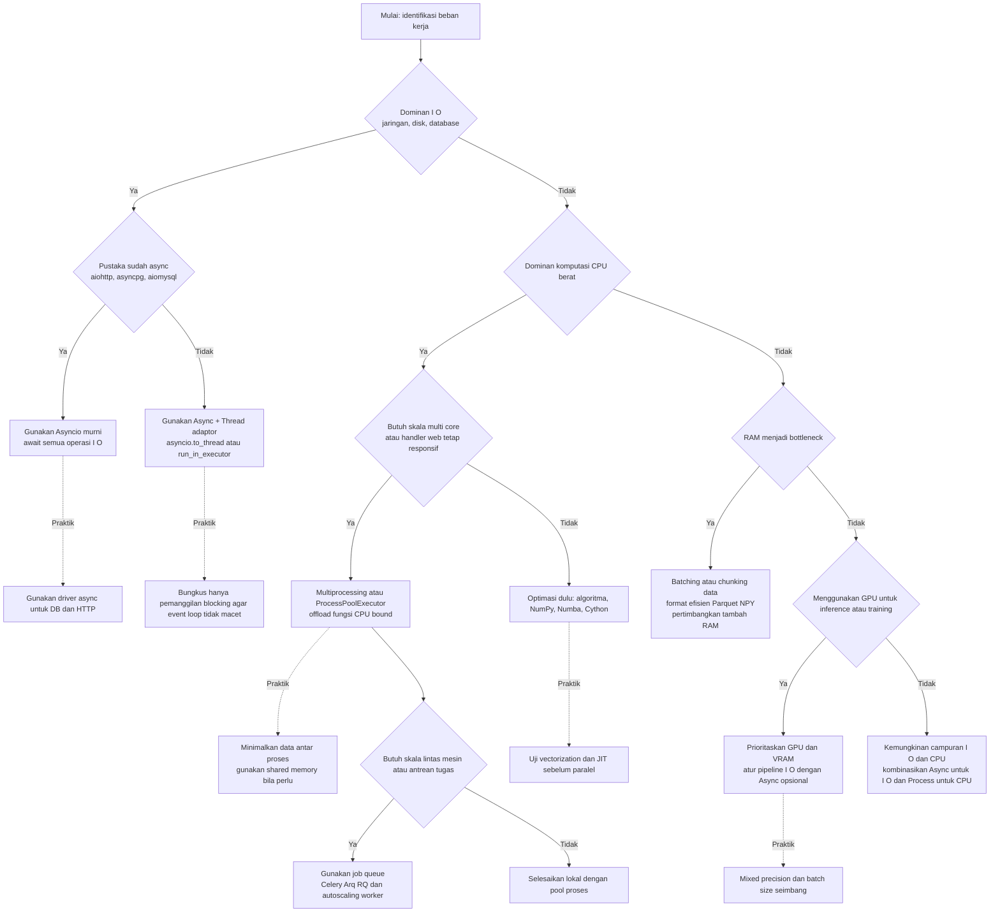

# 📘 Dokumentasi Asynchronous, Threading, dan Hubungan dengan Workload

---

## 1. Definisi

### 🔹 Asynchronous Programming (Async)

Gaya pemrograman **non-blocking** di Python:

* Program tidak menunggu satu task selesai baru lanjut.
* Task bisa **dijalankan bersamaan** (concurrent), terutama untuk **I/O-bound** (network, DB, file).
* Cocok untuk aplikasi dengan **banyak koneksi** (web server, chatbot, AI agent).
  👉 Sintaks: `async` / `await`.

### 🔹 Multithreading

Menjalankan **beberapa thread** dalam **satu proses**:

* Bagus untuk **I/O-bound** yang memakai library *blocking* (misalnya `requests`, driver DB sync).
* Terbatas oleh **GIL (Global Interpreter Lock)** → tidak efektif untuk **CPU-bound**.
  👉 Berguna sebagai adaptor untuk menjalankan fungsi *blocking* dalam aplikasi async.

### 🔹 Multiprocessing

Menjalankan **beberapa proses Python terpisah**:

* Setiap proses punya interpreter sendiri, **tidak kena GIL**.
* Efektif untuk **CPU-bound** (komputasi berat, ML training, image processing).
* Lebih berat resource karena setiap proses punya memori sendiri.

---

## 2. Perbedaan dengan Synchronous

### Synchronous (blocking)

```python
import time

def task(name):
    print(f"Start {name}")
    time.sleep(2)  # blocking
    print(f"End {name}")

task("A")
task("B")
```

⏳ Total waktu ≈ 4 detik (harus menunggu A selesai baru B jalan).

### Asynchronous (non-blocking)

```python
import asyncio

async def task(name):
    print(f"Start {name}")
    await asyncio.sleep(2)  # non-blocking
    print(f"End {name}")

async def main():
    await asyncio.gather(task("A"), task("B"))

asyncio.run(main())
```

⏳ Total waktu ≈ 2 detik (A & B jalan **bersamaan**).

---

## 3. Konsep Utama Async

1. **Event Loop** – pusat eksekusi coroutine (`asyncio.run()`).
2. **Coroutine** – fungsi `async def`, hanya bisa jalan di event loop.
3. **await** – titik di mana coroutine menunggu tanpa blocking event loop.
4. **Task** – coroutine yang dijadwalkan (`asyncio.create_task()`).

---

## 4. Kapan Dipakai?

### 📌 Async

* Web server high-concurrency (FastAPI, Quart, aiohttp).
* Banyak panggilan API eksternal (OpenAI, Weather API).
* Database driver async (`asyncpg`, `aiomysql`).
* Streaming file/network.
* WebSocket/chat server.
* AI Agent orchestration (LLM + DB + tools paralel).
* Web scraping ribuan URL (aiohttp).

👉 **Ideal untuk I/O-bound.**
❌ Tidak cocok untuk CPU-bound.

---

### 📌 Threading

* Cocok untuk **I/O-bound dengan library blocking** (misalnya `requests`, psycopg2).
* Digunakan **bersama async** via `asyncio.to_thread()` / `run_in_executor`.
* ❌ Tidak efektif untuk CPU-bound (tetap kena GIL).

---

### 📌 Multiprocessing

* Cocok untuk **CPU-bound** (perhitungan numerik, enkripsi, image processing).
* Digabung dengan async via `ProcessPoolExecutor`.
* ❌ Tidak cocok untuk I/O kecil, karena overhead tinggi.

---

## 5. Contoh Kombinasi

### Async + Thread (untuk library blocking)

```python
import asyncio, requests

async def fetch_url(url):
    return await asyncio.to_thread(lambda: requests.get(url).text)

async def main():
    html1, html2 = await asyncio.gather(
        fetch_url("https://example.com/1"),
        fetch_url("https://example.com/2"),
    )
    print(len(html1), len(html2))

asyncio.run(main())
```

### Async + Process (untuk CPU berat)

```python
import asyncio
from concurrent.futures import ProcessPoolExecutor

def heavy_task(n):
    return sum(i*i for i in range(n))

async def run_heavy(n):
    loop = asyncio.get_running_loop()
    with ProcessPoolExecutor() as pool:
        return await loop.run_in_executor(pool, heavy_task, n)

async def main():
    results = await asyncio.gather(run_heavy(10_000_000), run_heavy(10_000_000))
    print(results)

asyncio.run(main())
```

---

## 6. Tabel Perbandingan

### 🔄 Sync vs Async

| Aspek            | **Sync**                     | **Async**                           |
| ---------------- | ---------------------------- | ----------------------------------- |
| Eksekusi         | Satu per satu (blocking)     | Bisa jalan bersamaan (non-blocking) |
| Waktu Tunggu I/O | Menunggu selesai             | Task lain tetap jalan               |
| Use Case         | Script sederhana, CPU-bound  | Web server, API calls, DB, scraping |
| Resource         | Lebih berat (thread/process) | Hemat (event loop tunggal)          |

---

### 🔄 Thread vs Multiprocessing

| Aspek           | **Threading**                | **Multiprocessing**            |
| --------------- | ---------------------------- | ------------------------------ |
| Model           | Banyak thread dalam 1 proses | Banyak proses Python terpisah  |
| GIL             | ✅ Masih terikat GIL          | ❌ Tidak ada GIL                |
| Resource        | Hemat (shared memori)        | Lebih boros (copy interpreter) |
| Cocok untuk     | I/O-bound (blocking lib)     | CPU-bound (komputasi berat)    |
| Integrasi Async | `asyncio.to_thread()`        | `ProcessPoolExecutor`          |

---

## 7. Hubungan Workload/Bound dengan Async, Thread, Process

| Workload Bound | Async                      | Threading                    | Multiprocessing                       |
| -------------- | -------------------------- | ---------------------------- | ------------------------------------- |
| **CPU-bound**  | ❌ Tidak efektif            | ❌ Tidak efektif (kena GIL)   | ✅ Ideal (multi-core, lepas GIL)       |
| **RAM-bound**  | ⚠️ Tidak relevan           | ⚠️ Tidak relevan             | ✅ Bisa bantu (pecah data per proses)  |
| **GPU-bound**  | ⚠️ Hanya atur pipeline I/O | ⚠️ Tidak relevan             | ✅ Kadang dipakai koordinasi CPU → GPU |
| **I/O-bound**  | ✅ Ideal                    | ✅ Berguna untuk lib blocking | ❌ Tidak efisien                       |

---

## 8. Kesimpulan

* **Async** → solusi utama untuk **I/O-bound**.
* **Threading** → dipakai bersama async sebagai adaptor untuk library *blocking*.
* **Multiprocessing** → solusi utama untuk **CPU-bound**.
* **RAM-bound & GPU-bound** → lebih terkait **hardware & batching**, bukan async/thread/process.

👉 **Arsitektur yang direkomendasikan**:
Async di level aplikasi → Thread untuk adaptor library blocking → Process untuk CPU-heavy task.

---

## 9. Decision Tree Diagram



## Cara pakai cepat

* **Jika menunggu respons jaringan atau disk** → mulai dari **Async**.
* **Jika pustaka masih sync** → **Async + Thread adaptor** (`asyncio.to_thread` atau `run_in_executor`).
* **Jika menghitung berat di CPU** → **Multiprocessing** atau `ProcessPoolExecutor`.
* **Jika data menumpuk di RAM** → **chunking, batching, format efisien**, baru pertimbangkan tambah RAM.
* **Jika pakai GPU** → fokus **VRAM dan throughput**, Async hanya untuk mengatur alur I O.
